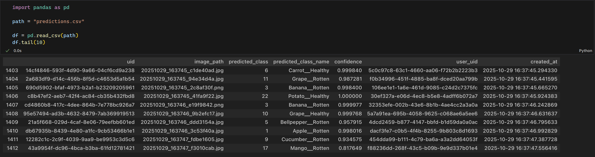
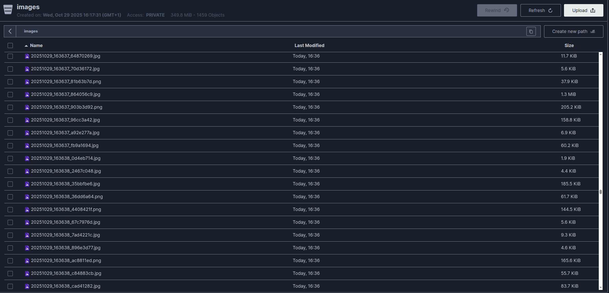

# RottenBot - Inference Service

## 🎯 Overview

This repository provides the **ML inference microservice** for the RottenBot project. Built with **FastAPI** and **TensorFlow**, this service handles real-time image classification requests, providing predictions on whether tomatoes are fresh or rotten. The service emphasizes **high performance**, **comprehensive observability**, and **secure authentication**.

The Inference Service was developed to demonstrate ML inference patterns, including model loading from MLflow or local filesystem, efficient background task processing, and distributed tracing. It integrates seamlessly with the RottenBot ecosystem through JWT-based authentication provided by the RottenBot_AuthService.

## ✨ Key Features

### Deep Learning & Inference
- 🤖 **TensorFlow/Keras Model Support** for image classification
- 🎯 **High-Performance Inference** with optimized preprocessing pipeline
- 📦 **Flexible Model Loading** from MLflow or local filesystem
- 🖼️ **Multi-Format Image Support** (JPEG, PNG, JPG)
- 🔄 **Class Index Mapping** with dynamic label resolution

### Performance & Scalability
- ⚡ **FastAPI Background Tasks** to minimize endpoint latency
- 🚀 **Impressive Performance**: Q99 latency at **98.3ms** with ~900 requests/minute
- 📊 **Async Database Operations** using SQLModel with AsyncSession
- 💾 **Redis Integration** for token validation

### Data Persistence & Storage
- 🗄️ **PostgreSQL** for prediction history storage
- 📁 **MinIO (S3-Compatible)** for image archival and possible future retraining
- 🔄 **Optional Prediction Saving** to reduce unnecessary I/O and gives the User a choice
- 📸 **Image Versioning** with timestamp-based unique paths

### Security & Authentication
- 👤 **User-Scoped Predictions** with User UUID tracking
- 🛡️ **Access Token Bearer Authentication** for all endpoints

### Observability & Monitoring
- 📊 **OpenTelemetry Tracing** for distributed tracing
- 📈 **Request Duration Metrics** with histogram tracking
- 📊 **API Call Counters** per endpoint
- 📝 **Structured Logging** throughout the inference pipeline
- 🔍 **Performance Bottleneck Detection** with detailed spans

## 🗄️ Database Schema

### Predictions Table

```python
class Prediction(SQLModel, table=True):
    __tablename__ = "predictions"

    uid: uuid.UUID              # Primary key, auto-generated UUID
    image_path: str             # Unique path to image in S3/MinIO
    predicted_class: int        # Numeric class index (0, 1, etc.)
    predicted_class_name: str   # Human-readable class name
    confidence: float           # Model confidence score (0.0-1.0)
    user_uid: uuid.UUID         # User who requested the prediction
    created_at: datetime        # Timestamp of prediction
```

### Example Prediction Record

Here's an example of how predictions are stored in the PostgreSQL database:



## 📦 Image Storage Architecture

All uploaded images are automatically stored in **MinIO** (S3-compatible storage) for possible future model retraining:



## 🔍 API Endpoints Overview

### POST /api/v1/inference/predict
**Perform image classification inference**

**Request Parameters:**
- `file` (UploadFile): The image file (JPEG/PNG)
- `save_prediction` (bool): Whether to save prediction to database and S3
- `user_uid` (UUID): The authenticated user's unique identifier

**Headers:**
```
Authorization: Bearer <access_token>
```

**Possible Responses:**

#### ✅ 200 OK - Prediction Successful
Model successfully classified the image.

```json
{
  "predicted_class": 1,
  "predicted_class_name": "Apple__Healthy",
  "confidence": 0.9234567
}
```

#### ❌ 400 Bad Request - Invalid File Type
The uploaded file is not a supported image format. This should be handled in the frontend but was implemented here for safety.

```json
{
  "detail": "Invalid file type. Only JPEG, JPG, and PNG are supported. Got image/gif"
}
```

#### ❌ 401 Unauthorized 
The access token is missing, expired, or invalid.

```json
{
  "detail": "Not authenticated"
}
```

#### ❌ 500 Internal Server Error - Prediction Error
An error occurred during image processing or model inference.

```json
{
  "detail": "Ooops! Something went wrong during prediction."
}
```

## 📊 Observability Features

### Distributed Tracing

The inference pipeline is fully instrumented with **OpenTelemetry spans**:

1. **predict_endpoint** - Overall request duration
2. **read_image_contents** - File upload time
3. **model_prediction** - Inference time
4. **preprocess_image** - Image preprocessing duration
5. **get_prediction** - Model forward pass time
6. **save_prediction_db** - Database write time (background)
7. **save_image_s3** - S3 upload time (background)

### Metrics Collection

- **inference_api_requests_total**: Counter of total inference requests
- **inference_api_duration_milliseconds**: Histogram of request durations

### Structured Logging

All operations include contextual logging:
```python
logger.info(f"User {user_uid} requested a prediction with save_prediction={save_prediction}.")
logger.warning(f"Invalid file type: {file.content_type}.")
logger.error(f"Error during prediction for user {user_uid}: {e}", exc_info=True)
```

### Performance Monitoring

Use observability data to:
- Identify slow database queries 
- Detect bottlenecks in authentication flow

## 🔐 Authentication Flow

The Inference Service relies on the **RottenBot_AuthService** for authentication:

1. User logs in via AuthService → receives JWT access token
2. User sends inference request with token in `Authorization` header
3. InferenceService validates token:
   - Decodes JWT using shared secret
   - Checks token type (must be access token, not refresh)
   - Verifies token is not in Redis blocklist
4. If valid, inference proceeds; if invalid, returns 401 Unauthorized

## 🚀 Quick Start

### Prerequisites
- **Docker & Docker Compose** for service orchestration
- **RottenBot_AuthService** running for authentication to get an Access Token


### Running with Docker Compose

```yaml
inference_service:
  container_name: inference_service
  image: nielsscholz/rotten_bot_inference:latest
  ports:
    - "8000:8000"
  environment:
    # look in the .env.example file for all required environment variables and explainations.
    DATABASE_URL: ${DATABASE_URL}

    REDIS_PASSWORD: ${REDIS_PASSWORD}
    REDIS_HOST: ${REDIS_HOST}
    REDIS_PORT: ${REDIS_PORT}

    JWT_SECRET: ${JWT_SECRET}
    JWT_ALGORITHM: ${JWT_ALGORITHM}

    MINIO_ROOT_USER: ${MINIO_ROOT_USER}
    MINIO_ROOT_PASSWORD: ${MINIO_ROOT_PASSWORD}
    LOCAL_S3_PROXY_SERVICE_URL: ${LOCAL_S3_PROXY_SERVICE_URL}

    ALLOY_ENDPOINT: ${ALLOY_ENDPOINT}

    USE_LOCAL: ${USE_LOCAL}
    
    MLFLOW_TRACKING_URI: ${MLFLOW_TRACKING_URI}
    MODEL_URI: ${MODEL_URI}
    RUN_ID: ${RUN_ID}
```

**When `USE_LOCAL=true`:**
- ✅ Model and Classes are loaded from inside the Docker image
- ✅ No MLflow server required
- ✅ Faster startup, easier testing
- ❌ No model versioning
- ❌ No centralized model registry

**When `USE_LOCAL=false`:**
- ✅ Model loaded from MLflow model registry
- ✅ Class mapping loaded from MLflow artifacts
- ✅ Model versioning and lineage tracking
- ✅ Centralized model management
- ❌ Requires RottenBot_ExperimentTracking service running

**⚠️ Important Note:**

The `USE_LOCAL` variable **only exists for testing purposes**. In a real production deployment, this variable would not be used. Instead, all models would be loaded from the MLflow server set up in the **RottenBot_ExperimentTracking** microservice. Alternatively, the model inside the Docker image could be used as a fallback, but this would not be controlled by an environment variable.

## 🤝 Integration with RottenBot Services

This inference service integrates with:

- **RottenBot_AuthService** - JWT authentication and user management
- **RottenBot_ExperimentTracking** - MLflow model registry and versioning

## 🤖 CI/CD Pipeline

### Current Implementation

This project includes a **simple CI pipeline** that automatically builds and deploys the Docker image to Docker Hub.

**Pipeline Trigger:**
- Runs on every commit to the `main` branch
- Automatically builds the Docker image using the Dockerfile
- Pushes the image to Docker Hub as `nielsscholz/rotten_bot_inference:latest`

### ⚠️ Important Notes

**This is NOT a production-ready pipeline!** The current setup was implemented for simplicity and demonstration purposes.

**Current Limitations:**
- No branch strategy (dev, staging, prod)
- Commits directly to `main` trigger deployment
- No automated testing before deployment
- No security scanning


## 📝 License

This project is part of the RottenBot ecosystem. See the main RottenBot repository for licensing information. 

This README.md file was written by AI but strictly followed by human review and edits.